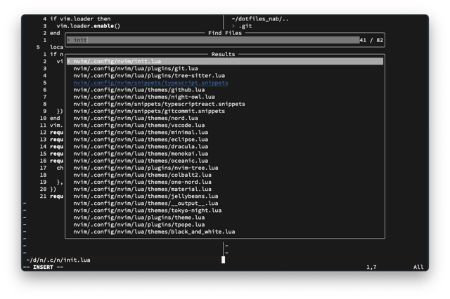

A Lush Theme for Neovim.
===

Installation
----
```lua
{
    'annguyenwasd/nineties.nvim'
    config = function()
        vim.cmd.colorscheme('nineties')
    end
}
```

Black and white theme, with Lush


**Lua file**
----


**With nvim-tree**
----


**Telecope**
----



**React file**
----


**Diff**
----

